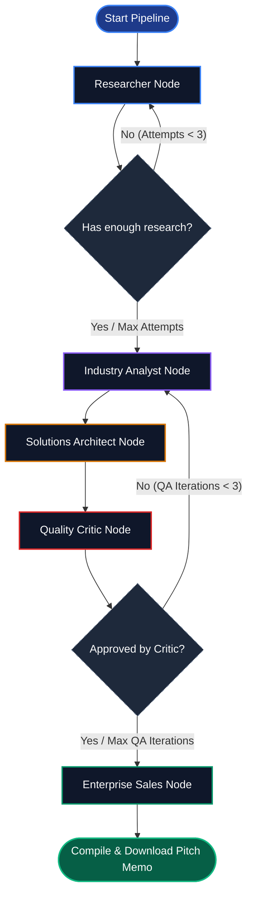

# 🧠 Enterprise Intelligence & AI Recommendation Engine

[](https://www.python.org/)
[](https://streamlit.io/)
[](https://github.com/langchain-ai/langgraph)
[](https://deepmind.google/technologies/gemini/)
[](LICENSE)

An autonomous multi-agent corporate research and strategic AI consultation system. Built on top of **LangGraph**, **LangChain**, and **Google Gemini Flash**, this application executes deep-dive corporate sweeps, pinpoints real-world business bottlenecks, engineers targeted 1:1 technical machine learning blueprints, and drafts personalized outreach sales proposals directed to the target enterprise's CEO.

All of this is presented in a premium **Streamlit web interface** styled with custom Glassmorphism cards, dynamic badges, responsive tabs, and a visual pipeline execution stepper that tracks agent transitions in real-time.

---

## 🗺️ System Architecture & Workflow

The core processing engine is implemented as an autonomous **stateful graph** using `langgraph`. The workflow features robust fallback mechanism wrappers and quality assurance check loops to guarantee highly detailed, non-trivial reports.



### 👥 The Agent Crew

1. **🕵️ Agentic Researcher (`Researcher`):** 
   - Uses `DuckDuckGoSearchResults` to scan the web for the company's official website.
   - Crawls and scrapes the official homepage and dynamically discovers/crawls the **About/Profile** page using `BeautifulSoup4` and robust HTTP headers.
   - Generates 3 highly targeted research queries to gather industry trends, recent developments, financial news, and expansion plans.
   - Extracts structured company overview profiles and strategic business indicators.
2. **📈 Industry Analyst (`Analyst`):**
   - Synthesizes the raw research logs to identify exactly **four distinct, high-impact business friction points**.
   - Ensures categorical coverage across: **Operational Bottlenecks**, **Sales Challenges**, **Customer Experience (CX) Challenges**, and **General/Scaling Challenges**.
3. **⚙️ Solutions Architect (`Architect`):**
   - Map 1:1 against the analyst's four challenges.
   - Designs concrete, production-grade technical AI architectures.
   - Avoids generic tech buzzwords by specifying precise ML frameworks, open-source models, libraries, and databases (e.g. *YOLOv8 via PyTorch*, *LayoutLMv3 fine-tuning*, *LlamaIndex RAG pipelines with Qdrant vector databases*, *XGBoost via Scikit-Learn*).
   - Outlines how incoming corporate data streams route through the proposed systems.
4. **🛡️ Quality Critic (`Critic`):**
   - Serves as an automated quality gatekeeper.
   - Reviews the alignment of the challenges and solutions against strict criteria.
   - Rejects the payload and routes back to the **Analyst** with remediation feedback if the solutions lack technical depth or structural alignment.
5. **💼 Enterprise Sales Pitcher (`Sales`):**
   - Compiles corporate details, challenges, and proposed technical architectures.
   - Drafts an executive-grade cold outreach package including a high-impact email subject, a brief executive summary, and a formal markdown business proposal addressing the company's CEO.

---

## ✨ Features

- **🧠 Multi-Agent State Machine:** Fully orchestrates complex processing loops, feedback routing, and retry loops using **LangGraph**.
- **🌐 Advanced Web Scraping:** Employs target-domain link extraction, crawling, parsing, and console + file logging of scraped details to `logs/scraped_data.log`.
- **🏗️ Structured Output Schemas:** Enforces type safety and semantic requirements by applying strict Pydantic schemas (using `llm.with_structured_output(...)`).
- **🛡️ Resiliency & Fallbacks:** Built-in exception handlers catch API errors or rate limits, auto-logging them to the UI and applying rich, pre-configured structural fallbacks.
- **🎨 Premium UI/UX Design:** 
  - Styled with the modern **Outfit** typography.
  - Implements high-end **Glassmorphic panels** with custom backdrop blur effects.
  - Features dynamic category badges (**Operational**, **Sales**, **CX**, **General**) and clear metric highlights.
  - Visual **Stepper** component reflecting pipeline progress node-by-node.
  - Interactive Tab layout with a **Markdown Downloader** to instantly save the CEO Pitch Memo.

---

## 📂 Project Structure

```text
AI-Powered Research & Recommendation/
├── app.py                  # Streamlit Premium Interface & Stepper UI
├── requirements.txt        # Python dependency manifests
├── .env                    # Environment credentials configuration (Git ignored)
├── logs/
│   └── scraped_data.log    # Scraping, search, and agent execution trace logs
└── src/
    ├── __init__.py         # Package entry marker
    ├── schemas.py          # Pydantic schemas (Overview, Challenges, Architectures, Pitches)
    ├── state.py            # TypedDict state structure for LangGraph
    ├── utils.py            # Search execution, BeautifulSoup web crawlers, loggers
    ├── workflow.py         # Graph compilation, node declarations, conditional routers
    └── agents/
        ├── __init__.py     # Agent module exports
        ├── researcher.py   # Web search and crawler node
        ├── analyst.py      # Business bottleneck identification node
        ├── architect.py    # Technical AI blueprint builder node
        ├── critic.py       # Quality review compliance gatekeeper node
        └── sales.py        # Executive sales memo generation node
```

---

## 🚀 Getting Started

### 📋 Prerequisites

- **Python 3.10** or higher installed.
- A **Google Gemini API Key** (Get one from [Google AI Studio](https://aistudio.google.com/)).

### ⚙️ Setup and Installation

1. **Clone the Repository:**
   ```bash
   git clone https://github.com/smit-faldu/AI-Powered-Research-Recommendation.git
   cd AI-Powered-Research-Recommendation
   ```

2. **Create and Activate a Virtual Environment:**
   ```bash
   # Windows (PowerShell)
   python -m venv .venv
   .venv\Scripts\Activate.ps1
   
   # macOS/Linux
   python3 -m venv .venv
   source .venv/bin/activate
   ```

3. **Install Dependencies:**
   ```bash
   pip install -r requirements.txt
   ```

4. **Configure Environment Variables:**
   Create a `.env` file in the root directory of the project and add your Google Gemini API Key:
   ```env
   GOOGLE_API_KEY=your_gemini_api_key_here
   ```

---

## 💻 Usage

To run the Streamlit application:

```bash
streamlit run app.py
```

### 🖥️ Working with the Web Interface:
1. **Launch the app**; your browser should automatically open `http://localhost:8501`.
2. Configure your desired **Generation Temperature** in the sidebar (ranging from `0.1` for precise engineering specs to `1.0` for creative copywriting pitches).
3. Type in the **Target Enterprise Name** (e.g., *Prestige Group*, *Brigade Group*, *Sobha*) in the main input field.
4. Click **Initiate Agentic Pipeline**.
5. Watch the **Stepper UI** transition through agents in real-time as they crawl the web, design frameworks, evaluate quality, and generate sales artifacts.
6. Once complete, explore the structured results:
   - **Corporate Overview:** Industry parameters, operational scales, regional footprint, and strategic public information.
   - **Business Challenges:** Structured 2x2 grid tracking identified bottlenecks.
   - **Targeted AI Blueprints:** Granular technical system integrations mapped to the challenges.
   - **Executive Pitch Memo:** A fully compiled cold email proposal ready to download as a Markdown file.

---

## 🛠️ Built With

* [LangGraph](https://github.com/langchain-ai/langgraph) - Cyclic stateful multi-agent system execution
* [LangChain](https://github.com/langchain/langchain) - Core model orchestration frameworks
* [Google Gemini Flash LLM](https://deepmind.google/technologies/gemini/) - LLM reasoning API & structured output extraction
* [Streamlit](https://streamlit.io/) - Premium user interface web application
* [BeautifulSoup4](https://www.crummy.com/software/BeautifulSoup/) - HTML parsing, navigation filtering & direct webpage text scraping
* [DuckDuckGo Search](https://pypi.org/project/duckduckgo-search/) - Organic search results parsing
* [Tenacity](https://github.com/jd/tenacity) - Rate-limiting recovery retry layers

---

## ✍️ Author

Created and maintained by **Smit Faldu**  
- **GitHub:** [@smit-faldu](https://github.com/smit-faldu)

---

## 📄 License

This project is licensed under the MIT License - see the [LICENSE](LICENSE) file for details.
